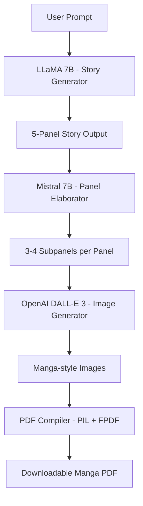

# MangaMatrix: AI Story-to-Comic Engine

MangaMatrix is an AI-powered comic generation pipeline that transforms short story prompts into manga-style comic panels. It leverages large language models and image generation APIs to build a fully automated storytelling and illustration engine.

## Features

- **Story Generation** – Uses a fine-tuned LLaMA model to convert user prompts into 5-panel story arcs.
- **Panel Elaboration** – Employs a Mistral-based model to break each panel into 3–4 subpanels with detailed scene descriptions.
- **Visual Generation** – Uses OpenAI’s DALL·E 3 to turn each subpanel into high-quality manga-style images.
- **PDF Compilation** – Automatically compiles all generated images into a downloadable manga PDF.
- **Interactive UI** – Clean, themed frontend with light/dark mode and smooth navigation between pages.

## Architecture Overview



### Key Components

- `UI/app.py`: Main entry point to run the web app with prompt input and response rendering.
- `Final_Generation_Pipeline.ipynb`: Ties together prompt, story generation, panel elaboration, image creation, and PDF compilation.
- `Anime_data_llama_finetune.ipynb`: Trains LLaMA on your custom anime-style data for improved panel storytelling.
- `static/generated/`: Location where your final manga-style PDF is saved for download.


## 🚀 Getting Started

### Prerequisites

- Python 3.8+
- API access to:
  - Hugging Face Inference Endpoints (LLaMA & Mistral models)
  - OpenAI DALL·E 3
- Basic knowledge of Flask

### Setup Instructions

```bash
# Clone the repo
git clone https://github.com/vigneshrb250/MangaMatrix-AI-Story-to-Comic-Engine.git
cd MangaMatrix-AI-Story-to-Comic-Engine

# Set up virtual environment
python -m venv venv
source venv/bin/activate  # On Windows: venv\Scripts\activate

# Install dependencies
pip install -r requirements.txt

# Create a .env file and add your API keys
touch .env
# Add OPENAI_API_KEY and HF_API_TOKEN inside .env

cd UI
python app.py
# Open http://localhost:5000 in your browser
```

## 🖼️ Sample Output

A 5-panel manga PDF with subpanel images generated using your input prompt.  
Each story includes:
- A visually styled cover page
- 5 core manga panels with 3–4 subpanel illustrations each
- Beautiful manga-style art powered by OpenAI DALL·E 3

You can download the generated PDF from the web interface after the story is processed.

---

## 🤝 Contributing

Got ideas or improvements?  
Feel free to fork the repo and submit a pull request – all contributions are welcome!

If you're interested in:
- Expanding panel diversity
- Improving UI design
- Adding new image generation models

We’d love your help. Let's build better manga together!

---

## 📄 License

This project is licensed under the **MIT License**.  
See the [LICENSE](LICENSE) file for more information.

